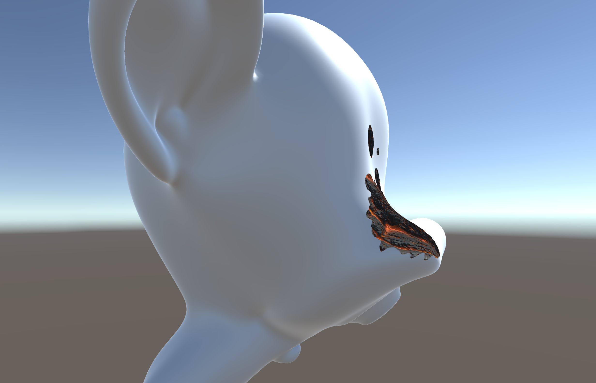
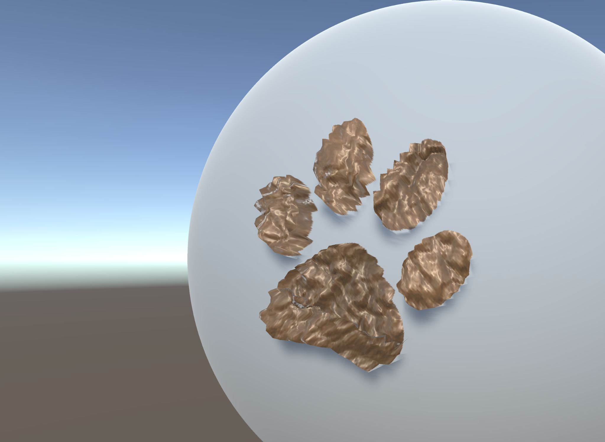
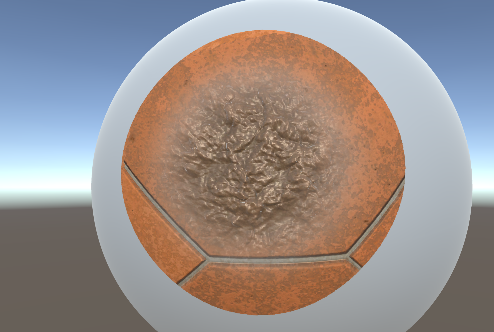

# SculptPaint-Unity
Sculpting and Painting package for Unity Runtime. Usefull for prototyping visual effects with world space painting and sculpting.

## Features
### **Painting**

Paint your model. Apply decals that take the surface shape into account. 

### **Sculpting**

Modify the vertices of your model. Apply a brush to push push positions towards a direction in local, world or tagent space.

### **Material Blending**

Blend any type of material without writting new shaders for blending.

## Supported Platforms
### Win, Mac, Linux :heavy_check_mark: 
Developed and tested on Win64 and DX11/12. All other desktop platforms and APIs should work but have not been tested.

### Android, iOS ✔️
Builds are possible, though code has been developed and optimized only for desktop build targets.

### WebGL ❌
WebGL does not support Compute Shaders.

## Supported Rendering Pipelines
* Built-In (Standard) ✔️
* URP ❌
* HDRP ❌

## Supported Editor Versions
* Unity 2022 LTS ✔️
* Unity 2021 LTS ✔️

## Installation
Install via the package manager. See https://docs.unity3d.com/Manual/upm-ui-giturl.html

## Usage
### Examples
Use the Demo/Scripts/Meltdown.cs file as an example of how to use the API.

### Creating custom behaviors
Create custom behaviors by using the Paint and Sculpt APIs.
#### Paint API
```csharp
        /// <summary>
        /// Create a paint component to paint on a mesh.
        /// </summary>
        /// <param name="settings">Paint settings to use</param>
        /// <param name="brushSettings"> Brush settings to use</param>
        /// <param name="renderer">The renderer of the object that is painted</param>
        /// <exception cref="Exception">Throws exception if initialization fails</exception>
        public Paint(PaintSettings settings, BrushSettings brushSettings, MeshRenderer renderer)

        /// <summary>
        /// The texture with the result. It has all the brush stamps accumulated.
        /// </summary>
        public RenderTexture Texture

        /// <summary>
        /// Update the texture with a brush stamp.
        /// </summary>
        /// <param name="position">The stamp position in local space</param>
        /// <param name="normal">The stamp normal vector in local space</param>
        /// <param name="forward">The desired stamp forward direction in local space</param>
        /// <exception cref="Exception">Throws exception if normal and forward are equal.</exception>
        public void Write(Vector3 position, Vector3 normal, Vector3 forward)

        /// <summary>
        /// Update the painted texture with the delay and dissipation parameters. Call this once per frame.
        /// </summary>
        public void Update()
```
#### Sculpt API
```csharp
        /// <summary>
        /// Create a Sculpt component to change the vertex positions of a mesh.
        /// </summary>
        /// <param name="settings"> Sculpt settings</param>
        /// <param name="brushSettings"> Brush settings </param>
        /// <param name="mesh">MeshFilter containing the mesh to be modifier. 
        /// Only an instance of the mesh will be modified instead the original mesh.</param>
        public Sculpt(SculptSettings settings, BrushSettings brushSettings, MeshFilter mesh)

        /// <summary>
        /// Update the geometry with brush stamp.
        /// </summary>
        /// <param name="position">The stamp position in local space</param>
        /// <param name="normal">The stamp normal vector in local space</param>
        /// <param name="forward">The desired stamp forward direction in local space</param>
        public void Update(Vector3 position, Vector3 normal, Vector3 forward)
```
### Rendering blended materials
#### 1. Masked Objects
Add a MaskObject component on the gameobject you want to render with blended materials. On you behavior script, reference the MaskObject component and use the API to update the mask with your texture.
```csharp
    /// <summary>
    /// Update the Mask.
    /// </summary>
    /// <param name="tex"> Texture to use as a mask</param>
    /// <param name="index">Index of mask to be updated</param>
    public void UpdateMask(Texture tex, int index)
```

#### 2. DeferredRender
Add a DeferredRender component to the camera that renders your scene. The component will automatically pick all the behaviors with MaskObject components and render them using the provided List of materials and mask channels.

## Credits
Originally, the system was working only in screen space. I implemented the approach described in [1] to convert it into world space. I extended it with decals (brushes) and my own solution for the rasterization artefact.

Used [2] to produce a 3x3 rotation matrix in my HLSL shaders.
### References
[1] Mesh Texture Painting in Unity using Shaders - Shahriar Shahrabi. https://shahriyarshahrabi.medium.com/mesh-texture-painting-in-unity-using-shaders-8eb7fc31221c

[2] https://gist.github.com/keijiro/ee439d5e7388f3aafc5296005c8c3f33
